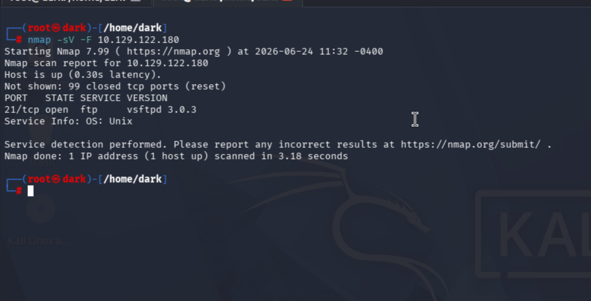
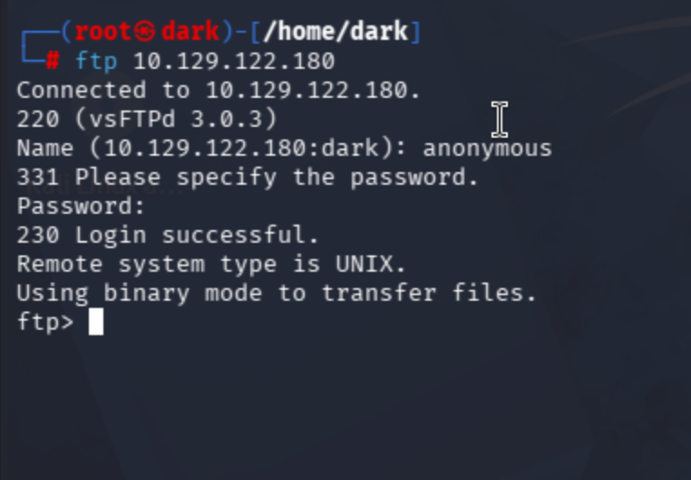
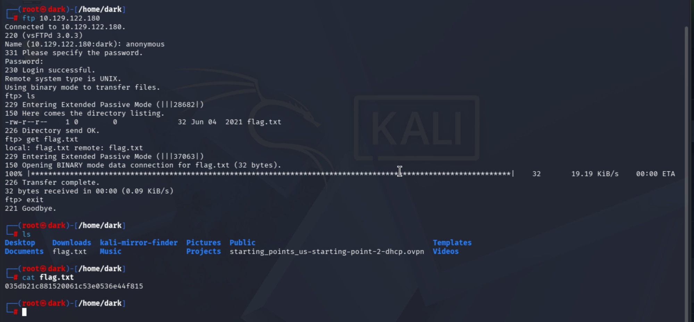

# Fawn

**Tier / Type:** Starting Point - Tier 0
**Difficulty:** Very Easy
**Skills practiced:** nmap, FTP, anonymous login

---

## Overview

Fawn focuses on the FTP protocol and the risk of **anonymous access** - a file
server that lets anyone log in without real credentials. The goal is to connect
over FTP using the anonymous account and download a file containing the flag.

## Enumeration

I ran a fast nmap service scan against the target:

```bash
nmap -sV -F 10.129.122.180
```

The scan showed one open port:

- **21/tcp - ftp** (vsftpd 3.0.3)

FTP on port 21 is a file-transfer service. The next logical step is to test
whether anonymous login is allowed.



## Gaining access

I connected to the FTP service and logged in with the **`anonymous`** account.
When prompted for a password, anonymous FTP accepts a blank password, so I just
pressed Enter:

```bash
ftp 10.129.122.180
# Name: anonymous
# Password: (blank - press Enter)
```

The server returned `230 Login successful` and dropped me into an FTP session -
the anonymous login is the core misconfiguration here.



## Findings

Inside the session I listed the directory, found `flag.txt`, and downloaded it,
then read it locally:

```bash
ls            # -rw-r--r-- ... flag.txt
get flag.txt  # download to my machine
exit
cat flag.txt
```

The flag was stored as `flag.txt` on the FTP server and retrievable because
anonymous access let me list and download files freely. (Flag value omitted.)



## What I learned

Anonymous FTP means anyone who can reach the server can read (and sometimes
write) files without authenticating. Combined with FTP sending data in clear
text, this is a serious exposure for anything sensitive. The fix is to disable
anonymous access, require authenticated accounts, and prefer SFTP/FTPS so the
traffic is encrypted.

## References / concepts

- FTP (TCP/21): clear-text file transfer; anonymous login is a common
  misconfiguration.
- SFTP / FTPS as the encrypted, authenticated alternatives.
