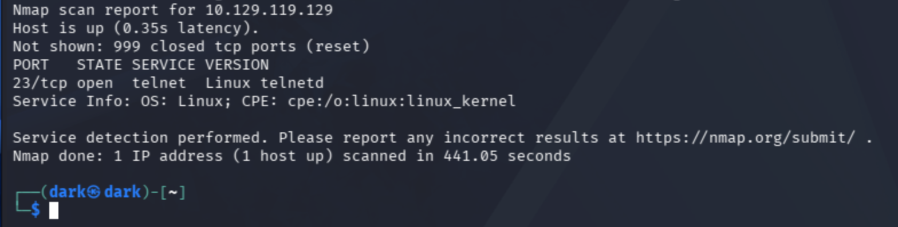
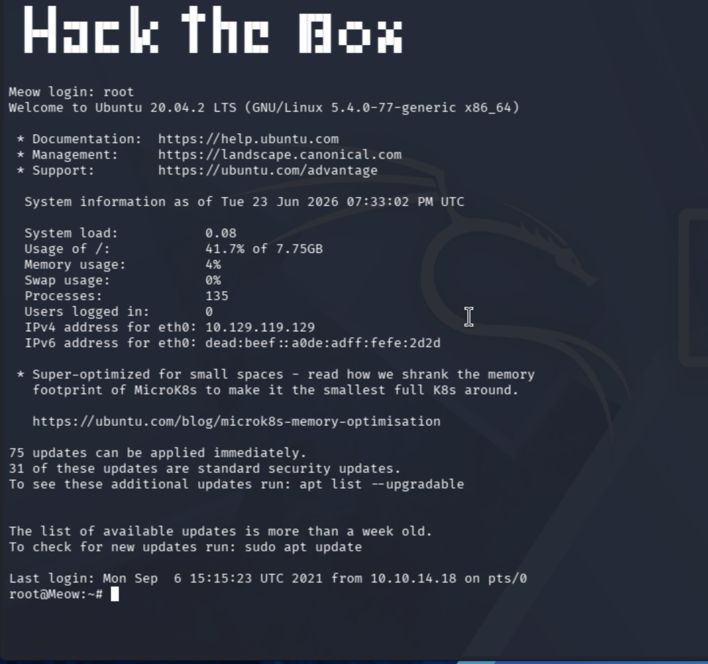
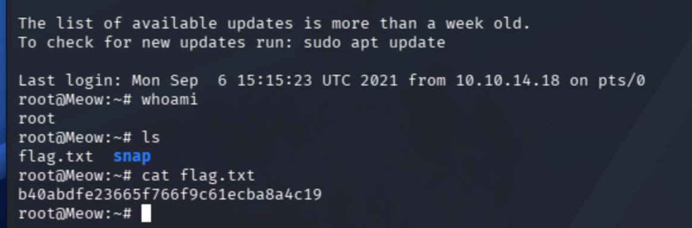

# Meow

**Tier / Type:** Starting Point - Tier 0
**Difficulty:** Very Easy
**Skills practiced:** nmap, telnet, basic enumeration, weak authentication

---

## Overview

Meow is the first HackTheBox Starting Point machine. It demonstrates one of the
most basic but serious misconfigurations: a remote administration service
(Telnet) exposed with a privileged account that has no password. The goal is to
connect to that service, log in, and read the flag.

## Enumeration

I started with an nmap service scan to see what was listening on the target.

```bash
nmap -sV 10.129.119.129
```

The scan showed a single open port:

- **23/tcp - telnet** (Linux telnetd)

Telnet is an old, unencrypted remote-login protocol. Finding it open immediately
suggests trying to connect to it directly.



## Gaining access

I connected to the Telnet service:

```bash
telnet 10.129.119.129
```

At the `Meow login:` prompt I tried common administrative usernames. The account
**`root`** logged in with **no password** - the box accepts root over Telnet
without authentication, which is the core vulnerability here. This dropped me
straight into a root shell on an Ubuntu 20.04 host.



## Findings

Once logged in as root, I confirmed my privileges and located the flag in root's
home directory:

```bash
whoami      # root
ls          # flag.txt
cat flag.txt
```

`whoami` confirmed root access, and the flag was stored as `flag.txt` in the home
directory - readable directly because I already had root. (Flag value omitted.)



## What I learned

Exposing Telnet at all is risky because it sends everything (including
credentials) in clear text. Exposing it with a passwordless root account is a
complete compromise - an attacker gets full control with a single connection and
no exploit required. The lesson: disable legacy services like Telnet, never allow
empty passwords, and never permit direct root login over the network.

## References / concepts

- Telnet (TCP/23): unencrypted remote login; replaced in practice by SSH.
- Why direct root login and empty passwords are flagged in any hardening guide
  (and in tools like the hardening checker in my linux-security-scripts repo).
