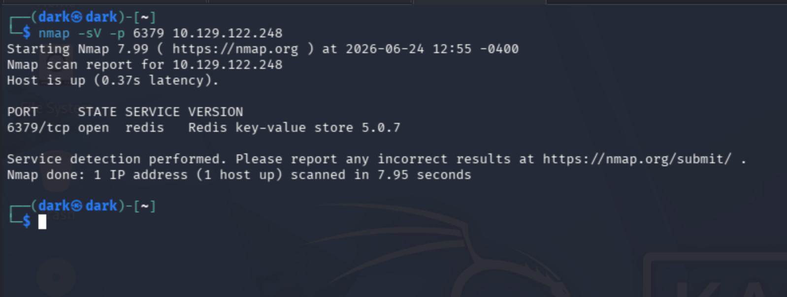
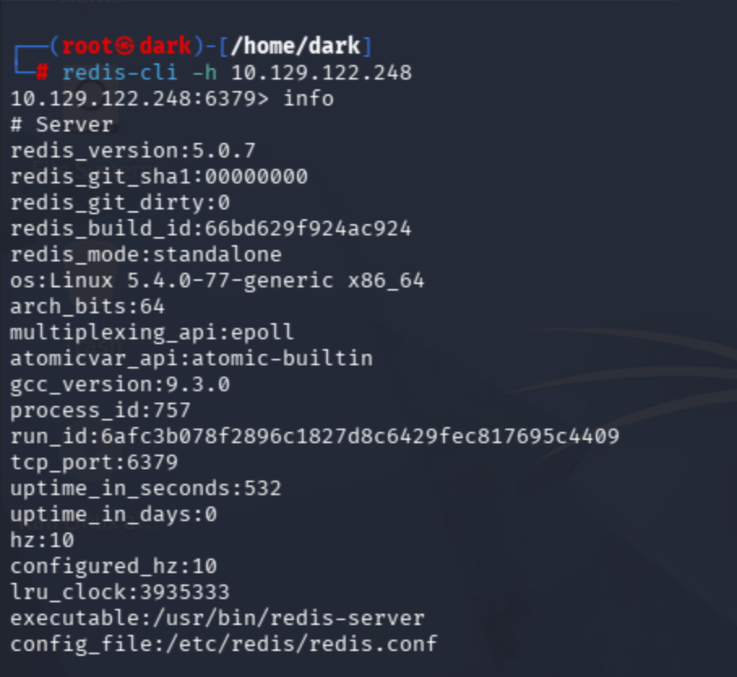
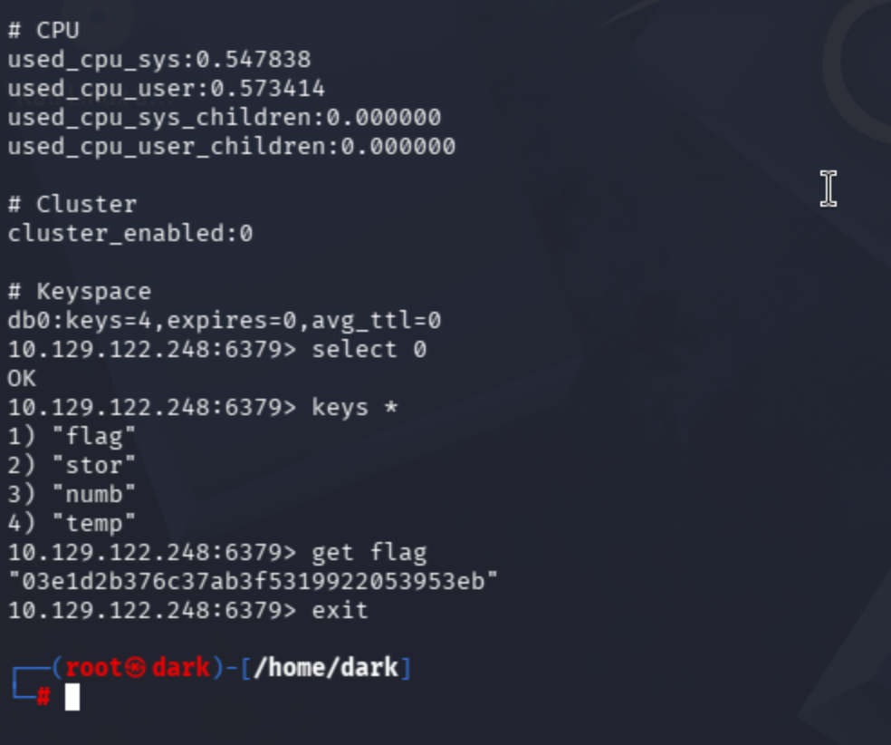

# Redeemer

**Tier / Type:** Starting Point - Tier 0
**Difficulty:** Very Easy
**Skills practiced:** nmap, Redis, unauthenticated database access

---

## Overview

Redeemer covers Redis, an in-memory key-value database. It demonstrates the risk
of running Redis with no authentication exposed to the network - anyone who can
reach it can connect and read its data. The goal is to connect to Redis and
retrieve the flag stored in one of its keys.

## Enumeration

Redis runs on port 6379, which isn't in nmap's default fast-scan set, so I scanned
that port directly:

```bash
nmap -sV -p 6379 10.129.122.248
```

The scan confirmed:

- **6379/tcp - redis** (Redis key-value store 5.0.7)

Finding Redis open and reachable suggests trying to connect directly with the
Redis client.



## Connecting to Redis

I connected with the redis-cli client (no credentials required - the core
misconfiguration):

```bash
redis-cli -h 10.129.122.248
```

The server accepted the connection and I ran `info` to inspect it. The output
confirmed Redis 5.0.7 and, in the **# Keyspace** section, showed `db0` held 4 keys.



## Finding the flag

I selected database 0, listed its keys, and read the one named `flag`:

```bash
select 0
keys *      # flag, stor, numb, temp
get flag
exit
```

The key `flag` held the flag value, readable directly because no password was
required. (Flag value omitted.)



## What I learned

Redis ships without authentication by default and is meant to run on a trusted,
internal network only. Exposing it to untrusted networks with no password lets
anyone read - and often modify - its data. The fix: bind Redis to localhost,
require a strong password with `requirepass`, and never expose it directly to the
internet.

## References / concepts

- Redis (TCP/6379): in-memory data store; insecure by default if exposed.
- `redis-cli`, `info`, `keys *`, and `get` for basic enumeration.
